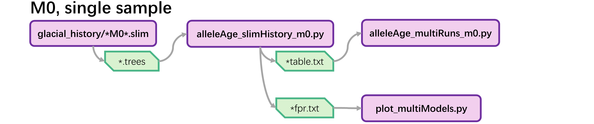
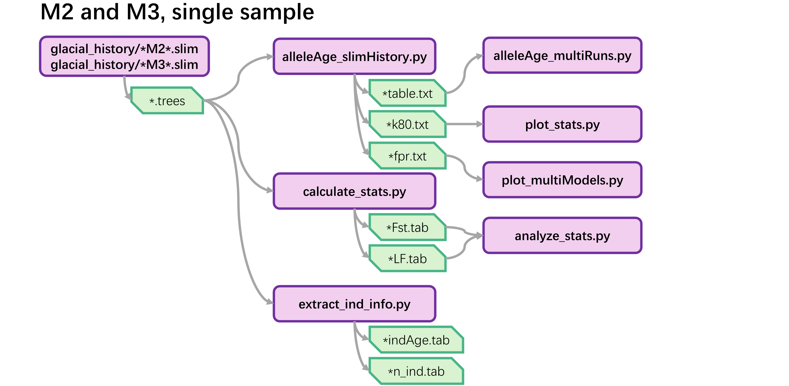
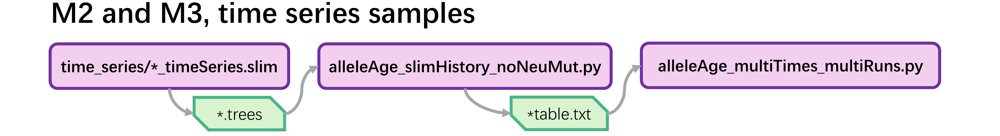

# arg-for-gea  
SLiM and Python scripts for exploring the genetic architecture of local adaptation and its implications for genotype-environment association (GEA) analysis, with a focus on the effects of allele age. Tree sequences are recorded during SLiM simulations and processed by Python scripts.  

#### Preprint:  
The genetic architecture of local adaptation is historically contingent  
Tianlin Duan, Michael C. Whitlock, Tom R. Booker  
bioRxiv 2026.02.01.703099; doi: https://doi.org/10.64898/2026.02.01.703099  

 
*Note: Models have been renamed in reports:  

|  Scripts  |  Reports  |
|  :----:   |   :----:  |
|    M0a    |  MNeuCon  |
|    M0b    |  MNeuExp  |
|    M2a    |  MSelCon  |
|    M2a    |  MSelExp  |
|    M3a    |  MRecCon  |
|    M3b    |  MRecExp  |

 
 

### Single-sample simulations  
arg-for-gea/slim/glacial_history/  

#### No selection (M0)  
  
      
#### With selection (M2,M3)  
  
 

### Time-series-sample simulations 
arg-for-gea/slim/glacial_history/time_series/  

  
